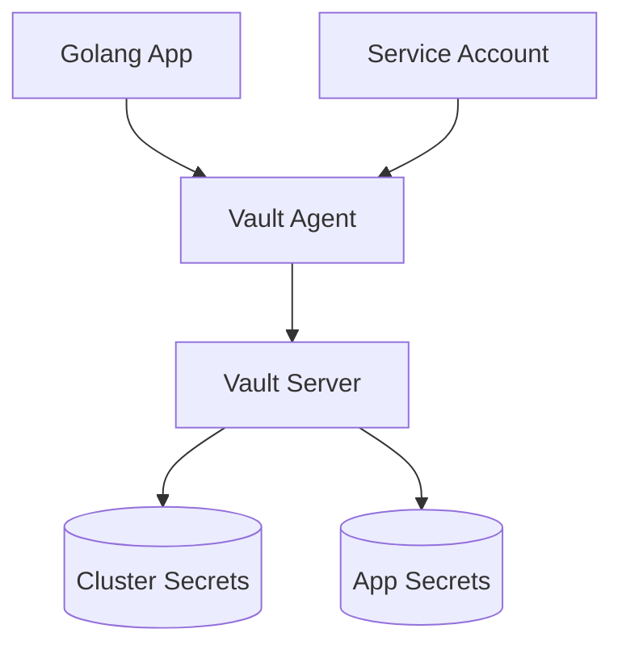
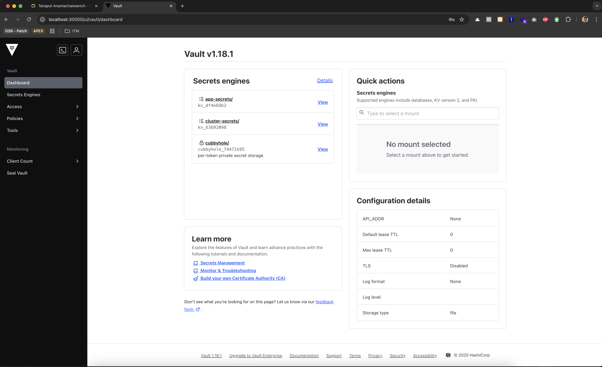

# Vault Kubernetes Secret Management PoC

A proof-of-concept demonstrating secure secret management in Kubernetes using HashiCorp Vault, implemented with Go 1.22 and the Fiber framework. This project showcases best practices for managing both cluster-level and application-level secrets in a Kubernetes environment.

## 🎯 Features

- **Dual Secret Management**: Separate paths for cluster and application secrets
- **Secure Authentication**: Kubernetes-native service account authentication
- **Modern Stack**: Go 1.22, Fiber framework, and HashiCorp Vault 1.18
- **Developer Friendly**: Easy local setup with Kind
- **Production Ready**: Implements security best practices

## 🏗 Architecture



## 🚀 Quick Start

### Prerequisites

- Docker Desktop
- Go 1.22+
- kubectl
- Helm v3
- Kind

### 1. Clone and Setup

```bash
git clone <repository-url>
cd poc-vault-go-kube

# Create Kubernetes cluster
kind create cluster --config k8s/kind-config.yaml --name vault-demo

# Create namespaces
kubectl create namespace vault
kubectl create namespace app
```

### 2. Install Vault

```bash
# Add Vault Helm repository
helm repo add hashicorp https://helm.releases.hashicorp.com
helm repo update

# Install Vault
helm install vault hashicorp/vault \
  --namespace vault \
  -f k8s/vault/values.yaml

# Initialize Vault
kubectl -n vault exec -it vault-0 -- vault operator init

# Unseal Vault (run 3 times with different keys)
kubectl -n vault exec -it vault-0 -- vault operator unseal
```

### 3. Configure Vault

```bash
# Set up authentication and secret engines
./scripts/setup-vault.sh

# Verify Vault status
kubectl -n vault exec -it vault-0 -- vault status
```

### 4. Deploy Application

```bash
# Build and load Docker image
cd app && docker build -t vault-demo-app:latest .
kind load docker-image vault-demo-app:latest --name vault-demo

# Deploy application
kubectl apply -f k8s/app/
```

## 📁 Project Structure

```
.
├── app/                    # Go application
│   ├── config/            # Configuration management
│   ├── handlers/          # HTTP route handlers
│   ├── vault/             # Vault client implementation
│   ├── main.go            # Application entry point
│   ├── Dockerfile         # Multi-stage build
│   └── go.mod            # Go dependencies
├── k8s/                   # Kubernetes configurations
│   ├── app/              # Application manifests
│   ├── vault/            # Vault configurations
│   └── kind-config.yaml  # Kind cluster config
└── scripts/              # Utility scripts
```

## 🔑 Secret Management

### Cluster Secrets (`/cluster-secrets/*`)

```bash
# Example: Retrieve database credentials
curl http://localhost:30001/cluster-secret/database
```

### Application Secrets (`/app-secrets/*`)

```bash
# Example: Retrieve API keys
curl http://localhost:30001/app-secret/api-keys
```

## 🛡 Security Features

1. **Authentication**

   - Kubernetes service account-based
   - Automatic token rotation
   - Role-based access control

2. **Secret Storage**

   - KV Version 2 secret engine
   - Versioned secrets
   - Path-based isolation

3. **Network Security**
   - TLS encryption
   - Internal service communication
   - Limited external access

## 🖥️ Vault UI

Access the Vault UI through your browser at `http://localhost:30000`:



The UI provides a user-friendly interface for:

- Managing secrets
- Configuring authentication methods
- Monitoring Vault status
- Managing policies and access control

## 🔧 Configuration

Environment variables for the application:

```bash
VAULT_ADDR=http://vault.vault:8200    # Vault server address
VAULT_ROLE_NAME=app-role              # Kubernetes auth role
```

## 📚 API Endpoints

- `GET /health` - Health check
- `GET /cluster-secret/:path` - Retrieve cluster secrets
- `GET /app-secret/:path` - Retrieve application secrets

## 🤝 Contributing

1. Fork the repository
2. Create a feature branch
3. Commit your changes
4. Push to the branch
5. Create a Pull Request

## 📝 License

This project is licensed under the MIT License - see the LICENSE file for details.

- Uses Kubernetes Service Account tokens
- No static credentials in code or configuration

2. **Authorization**

   - Separate policies for cluster and application secrets
   - Principle of least privilege

3. **Secret Rotation**
   - Automated secret rotation
   - Token TTL management

## Development

1. **Local Development**

   ```bash
   cd app
   go run main.go
   ```

2. **Building the Container**

   ```bash
   docker build -t your-registry/app:tag .
   ```

3. **Testing**
   ```bash
   go test ./...
   ```

## Accessing Services

- Vault UI: http://localhost:30000
- Application: http://localhost:30001

## Troubleshooting

1. **Vault Status**

   ```bash
   kubectl -n vault exec -it vault-0 -- vault status
   ```

2. **View Application Logs**

   ```bash
   kubectl -n app logs -l app=golang-app
   ```

3. **Common Issues**
   - Vault Sealed: Run unseal command
   - Auth Failed: Check service account token
   - Connection Failed: Verify network policies

## Contributing

1. Fork the repository
2. Create your feature branch
3. Commit your changes
4. Push to the branch
5. Create a Pull Request

## License

MIT License - see LICENSE file for details
