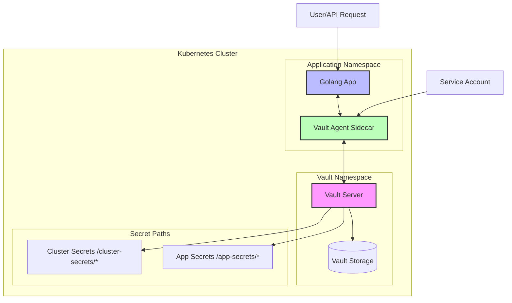

# Kubernetes + Vault + Golang Integration PoC

This PoC demonstrates the integration of HashiCorp Vault with Kubernetes, implementing separate secret management for cluster-level and application-level secrets using Golang and Fiber framework.

## Architecture Overview

### System Architecture Diagram



### Flow Description

1. The Golang application runs in its own namespace with a Vault Agent sidecar
2. Vault Agent authenticates with Vault using Kubernetes Service Account
3. Application can request secrets through Vault Agent
4. Secrets are segregated into cluster-level and application-level paths
5. All communications are secured using TLS

### Components

1. **Kubernetes Cluster**

   - Will host our application and Vault
   - Requires proper RBAC configuration

2. **HashiCorp Vault**

   - Deployed in Kubernetes
   - Two distinct secret paths:
     - `/cluster-secrets/*` - For cluster-level configurations
     - `/app-secrets/*` - For application-specific secrets

3. **Golang Application**
   - Built with Fiber framework
   - Demonstrates secret retrieval from Vault
   - Uses Vault Agent for authentication

## Implementation Plan

## Implementation Details

### 1. Kubernetes Setup with Kind

We've successfully set up a local Kubernetes cluster using Kind with the following configuration:

```yaml
# kind-config.yaml
kind: Cluster
apiVersion: kind.x-k8s.io/v1alpha4
name: vault-demo
nodes:
  - role: control-plane
  - role: worker
  - role: worker
networking:
  apiServerAddress: "127.0.0.1"
  apiServerPort: 6443
```

The cluster is configured with:

- One control-plane node
- Two worker nodes for high availability
- NodePort services for accessing applications

### 2. Vault Setup

Vault has been successfully deployed with the following features:

1. **Installation**:

   - Deployed using Helm chart in the `vault` namespace
   - Running in standalone mode with file storage
   - Vault UI accessible via NodePort

2. **Configuration**:

   - Initialized with 5 key shares and 3 key threshold
   - Kubernetes authentication enabled
   - Two KV v2 secret engines mounted:
     - `cluster-secrets/` for cluster-wide secrets
     - `app-secrets/` for application-specific secrets

3. **Authentication**:
   - Using Kubernetes service account tokens
   - RBAC configured for secure authentication
   - Role-based access control implemented

### 3. Application Implementation

The Golang application demonstrates several key features:

1. **Architecture**:

   - Built with Fiber framework
   - Uses Vault Agent Injector for authentication
   - Implements clean separation of concerns

2. **Key Components**:

   - `config/`: Configuration management
   - `vault/`: Vault client implementation
   - `handlers/`: HTTP route handlers

3. **Secret Management**:
   - Separate endpoints for cluster and app secrets
   - Proper error handling and validation
   - Support for KV v2 secret engine

## Lessons Learned

1. **Vault Integration**:

   - KV v2 secret engine requires `/data/` in paths
   - Secret data is nested under `data` key in responses
   - Vault Agent simplifies token management

2. **Kubernetes Setup**:

   - RBAC is crucial for secure operation
   - Service account tokens need proper permissions
   - NodePort services work well for local testing

3. **Application Design**:
   - Separation of config and client logic improves maintainability
   - Error handling is critical for secret management
   - Environment variables provide flexibility

## Testing Results

1. **Secret Retrieval**:

   ```bash
   # Cluster Secrets
   $ curl http://localhost:30001/cluster-secret/database
   {"secret":{"url":"postgresql://db.example.com:5432","username":"admin"}}

   # Application Secrets
   $ curl http://localhost:30001/app-secret/api-keys
   {"secret":{"sendgrid":"sg_test_example","stripe":"sk_test_example"}}
   ```

2. **Health Check**:

   ```bash
   $ curl http://localhost:30001/health
   {"status":"healthy"}
   ```

3. **Golang Application**

   - [ ] Create basic Fiber application structure
   - [ ] Implement Vault client integration
   - [ ] Add endpoints to demonstrate secret retrieval:
     - `/cluster-secret` - Shows retrieval of cluster-level secret
     - `/app-secret` - Shows retrieval of application-level secret
   - [ ] Implement proper error handling and logging

4. **Documentation**
   - [ ] Write detailed setup instructions
   - [ ] Document API endpoints
   - [ ] Add configuration examples
   - [ ] Include testing instructions

## Expected Directory Structure

```tree
# Project root
├── kind/
│   ├── kind-config.yaml       # Kind cluster configuration
│   └── setup-cluster.sh       # Cluster setup script
.
├── README.md
├── k8s/
│   ├── vault/
│   │   ├── deployment.yaml
│   │   └── rbac.yaml
│   └── app/
│       ├── deployment.yaml
│       └── service.yaml
├── app/
│   ├── main.go
│   ├── handlers/
│   ├── config/
│   └── vault/
└── scripts/
    └── setup-vault.sh
```

## Authentication Methods

### Kubernetes Auth Method (What we'll use)

- **Best for**: Applications running within Kubernetes
- **How it works**: Uses Kubernetes Service Account tokens for authentication
- **Advantages**:
  - Native integration with Kubernetes
  - Automatic token management
  - Uses existing Kubernetes RBAC
  - No need to manage additional credentials

### AppRole Auth Method (Alternative)

- **Best for**:
  - Applications running outside Kubernetes
  - Microservices in non-Kubernetes environments
  - CI/CD pipelines
  - Automated processes/scripts
- **When to use**:
  1. Applications running on VMs or bare metal
  2. Legacy applications that can't use Kubernetes auth
  3. External services needing Vault access
  4. Automated jobs running outside the cluster
- **How it works**:
  1. Application gets RoleID (like a username)
  2. Application gets SecretID (like a password)
  3. Both are used to authenticate and get a Vault token

### Why We're Not Using AppRole

For our PoC, we're using Kubernetes auth because:

1. Our application runs inside Kubernetes
2. Kubernetes auth provides better integration and security
3. No need to manage additional credentials (RoleID/SecretID)
4. Automatic token rotation through service accounts

## Security Considerations

- Vault tokens and sensitive data will be properly secured
- Kubernetes service accounts will be used for authentication
- Proper RBAC policies will be implemented
- Secrets will be rotated periodically

## Pre-Implementation Checklist

### 1. Required Tools Installation

- [ ] Docker Desktop is installed and running
- [ ] Kind is installed (`brew install kind`)
- [ ] kubectl is installed (`brew install kubectl`)
- [ ] Helm is installed (`brew install helm`)
- [ ] Go 1.21+ is installed (`brew install go`)

### 2. Environment Verification

```bash
# Run these commands to verify your setup:
docker --version
kind --version
kubectl version
helm version
go version
```

### 3. Project Structure Setup

- [ ] Create project directories:
  ```bash
  mkdir -p kind k8s/{vault,app} app scripts
  ```
- [ ] Initialize Go module:
  ```bash
  go mod init github.com/yourusername/poc-vault-go-kube
  ```
- [ ] Install required Go packages:
  ```bash
  go get -u github.com/gofiber/fiber/v2
  go get -u github.com/hashicorp/vault/api
  ```

### 4. Network Requirements

- [ ] Ports 30000-30001 are available (for Vault UI and app)
- [ ] Internet access for pulling images
- [ ] No VPN conflicts with Kubernetes networking

### 5. Docker Resources

- [ ] Sufficient CPU allocated to Docker (at least 2 cores)
- [ ] Sufficient Memory allocated (at least 4GB)
- [ ] Sufficient Disk Space (at least 10GB free)

### 6. Security Prerequisites

- [ ] Access to create Kubernetes resources (RBAC)
- [ ] Permission to run containers locally
- [ ] No conflicting Kubernetes contexts

## Local Development Setup

1. **Install Kind**

   ```bash
   brew install kind
   ```

2. **Create Cluster**

   ```bash
   kind create cluster --config kind/kind-config.yaml --name vault-demo
   ```

3. **Verify Setup**
4. ```bash
   kubectl get nodes
   kubectl get pods -A
   ```

## Next Steps

1. Review and approve this implementation plan
2. Begin with Kubernetes and Vault setup
3. Implement the Golang application
4. Create comprehensive documentation

Please review and approve this plan before proceeding with the implementation.
