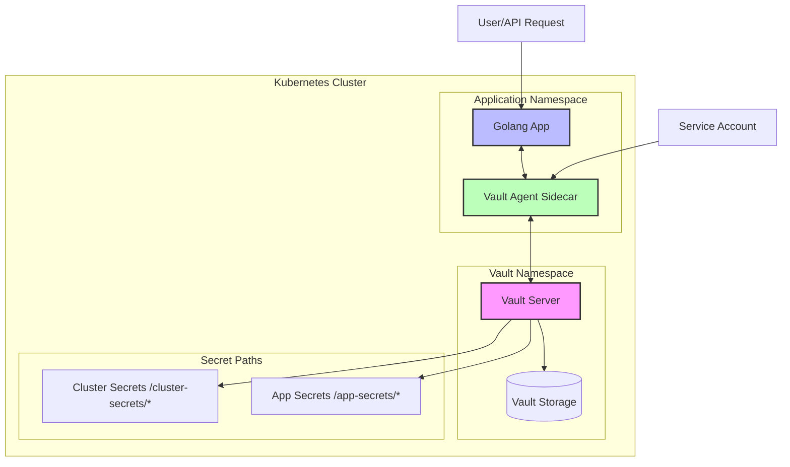

# Kubernetes + Vault + Golang Integration PoC

This PoC demonstrates the integration of HashiCorp Vault with Kubernetes, implementing separate secret management for cluster-level and application-level secrets using Golang and Fiber framework.

## Architecture Overview

### System Architecture Diagram



### Flow Description

1. The Golang application runs in its own namespace with a Vault Agent sidecar
2. Vault Agent authenticates with Vault using Kubernetes Service Account
3. Application can request secrets through Vault Agent
4. Secrets are segregated into cluster-level and application-level paths
5. All communications are secured using TLS

### Components

1. **Kubernetes Cluster**

   - Will host our application and Vault
   - Requires proper RBAC configuration

2. **HashiCorp Vault**

   - Deployed in Kubernetes
   - Two distinct secret paths:
     - `/cluster-secrets/*` - For cluster-level configurations
     - `/app-secrets/*` - For application-specific secrets

3. **Golang Application**
   - Built with Fiber framework
   - Demonstrates secret retrieval from Vault
   - Uses Vault Agent for authentication

## Implementation Plan

### TODO List (Please approve before implementation)

1. **Kubernetes Setup with Kind**

   - [ ] Create local Kubernetes cluster using Kind:
     ```yaml
     # kind-config.yaml
     kind: Cluster
     apiVersion: kind.x-k8s.io/v1alpha4
     nodes:
       - role: control-plane
         extraPortMappings:
           - containerPort: 30000 # For Vault UI
             hostPort: 30000
           - containerPort: 30001 # For our Golang app
             hostPort: 30001
       - role: worker
       - role: worker
     ```
   - [ ] Set up necessary namespaces:
     - `vault` for HashiCorp Vault
     - `app` for our Golang application
   - [ ] Configure RBAC for Vault and application

2. **Vault Setup**

   - [ ] Deploy Vault in Kubernetes
   - [ ] Initialize and unseal Vault
   - [ ] Configure Kubernetes authentication method
   - [ ] Create separate secret paths and policies
   - [ ] Add sample secrets for testing

3. **Golang Application**

   - [ ] Create basic Fiber application structure
   - [ ] Implement Vault client integration
   - [ ] Add endpoints to demonstrate secret retrieval:
     - `/cluster-secret` - Shows retrieval of cluster-level secret
     - `/app-secret` - Shows retrieval of application-level secret
   - [ ] Implement proper error handling and logging

4. **Documentation**
   - [ ] Write detailed setup instructions
   - [ ] Document API endpoints
   - [ ] Add configuration examples
   - [ ] Include testing instructions

## Expected Directory Structure

```tree
# Project root
├── kind/
│   ├── kind-config.yaml       # Kind cluster configuration
│   └── setup-cluster.sh       # Cluster setup script
.
├── README.md
├── k8s/
│   ├── vault/
│   │   ├── deployment.yaml
│   │   └── rbac.yaml
│   └── app/
│       ├── deployment.yaml
│       └── service.yaml
├── app/
│   ├── main.go
│   ├── handlers/
│   ├── config/
│   └── vault/
└── scripts/
    └── setup-vault.sh
```

## Security Considerations

- Vault tokens and sensitive data will be properly secured
- Kubernetes service accounts will be used for authentication
- Proper RBAC policies will be implemented
- Secrets will be rotated periodically

## Development Prerequisites

1. **Required Tools**
   - Docker Desktop
   - Kind (Kubernetes in Docker)
   - kubectl
   - Helm (for Vault installation)
   - Go 1.21+

## Local Development Setup

1. **Install Kind**

   ```bash
   brew install kind
   ```

2. **Create Cluster**

   ```bash
   kind create cluster --config kind/kind-config.yaml --name vault-demo
   ```

3. **Verify Setup**
4. ```bash
   kubectl get nodes
   kubectl get pods -A
   ```

## Next Steps

1. Review and approve this implementation plan
2. Begin with Kubernetes and Vault setup
3. Implement the Golang application
4. Create comprehensive documentation

Please review and approve this plan before proceeding with the implementation.
